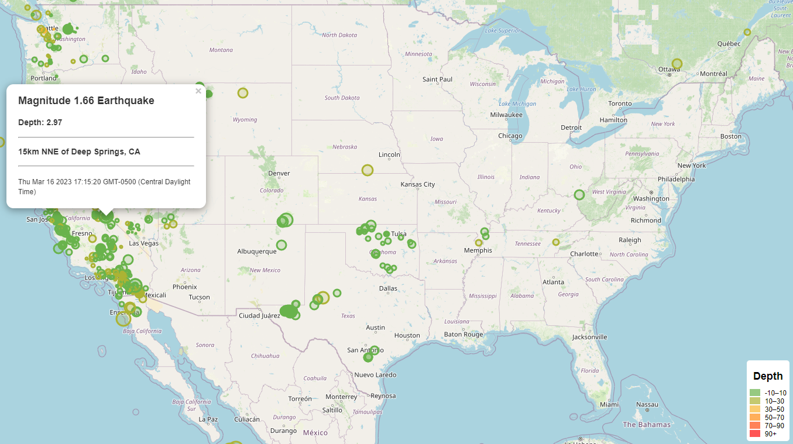

# Earthquake Data Visualization

This project visualizes earthquake data from the USGS (United States Geological Survey) on a map using Leaflet.js. Earthquake data from the past week is fetched from the USGS API and displayed on the map with circle markers representing the location, magnitude, and depth of each earthquake.

## Requirements

- JavaScript
- Leaflet.js
- D3.js
- A modern web browser (e.g., Google Chrome, Mozilla Firefox)

## Installation

1. Clone the repository
2. Ensure you have a modern web browser installed.
3. Open the `index.html` file containing the map in your web browser locally.

## Usage

The earthquake data is automatically fetched and displayed on the map when you open the HTML file.

* Circle markers represent the location, magnitude, and depth of each earthquake.
* The size of the markers is proportional to the magnitude, and the color indicates the depth.
* Hover over a circle marker to see a popup with more details about the earthquake, including its magnitude, depth, location, and date.
* The legend at the bottom-right corner of the map shows the depth color codes.

