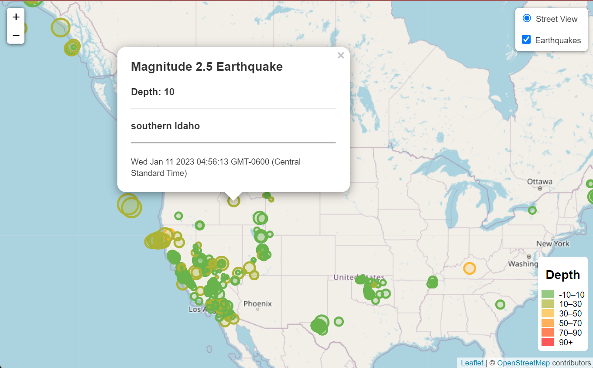

# leaflet-challenge

# Background

The United States Geological Survey, or USGS for short, is responsible for providing scientific data about natural hazards, the health of our ecosystems and environment, and the impacts of climate and land-use change. Their scientists develop new methods and tools to supply timely, relevant, and useful information about the Earth and its processes.

The USGS is interested in building a new set of tools that will allow them to visualize their earthquake data. They collect a massive amount of data from all over the world each day, but they lack a meaningful way of displaying it. In this challenge, you have been tasked with developing a way to visualize USGS data that will allow them to better educate the public and other government organizations (and hopefully secure more funding) on issues facing our planet

---

# Data Source

USGS GeoJSON Data Feed: https://earthquake.usgs.gov/earthquakes/feed/v1.0/geojson.php

Data used for this visual: 

Past 7 Days - [All Earthquakes](https://earthquake.usgs.gov/earthquakes/feed/v1.0/summary/all_week.geojson)

# Earthquake Visual Example

[Visit Interactive Map](https://nerdosth.github.io/leaflet-challenge/Leaflet-Part-1/)

**Circle Radius**: Represents the magnitude of the earthquake 

**Color**: Represents the depth of the Earthquake: "The depths of earthquakes give important information about the Earth's structure and the tectonic setting where the earthquakes are occurring" -usgs.gov
